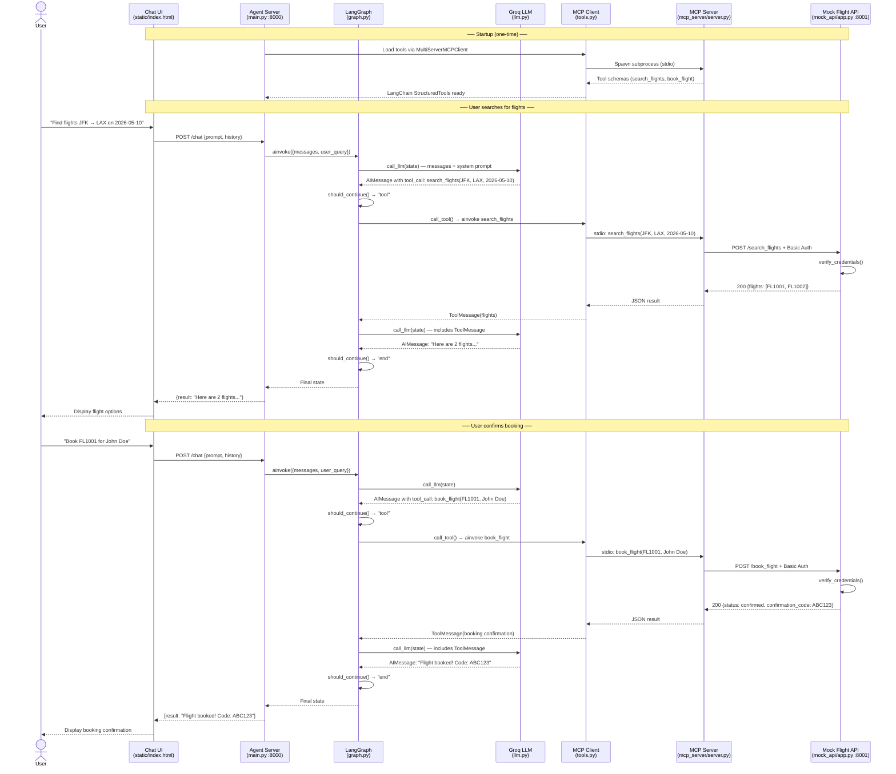
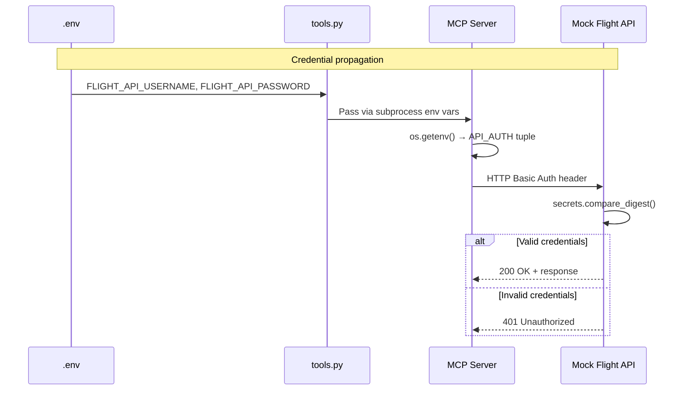
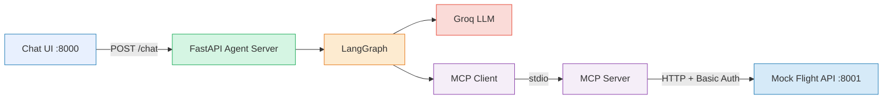

# Flight Booking Agent — Sequence Diagram

## Full Flow: Search & Book a Flight

```mermaid
sequenceDiagram
    actor User
    participant UI as Chat UI<br/>(static/index.html)
    participant API as Agent Server<br/>(main.py :8000)
    participant Graph as LangGraph<br/>(graph.py)
    participant LLM as Groq LLM<br/>(llm.py)
    participant MCP as MCP Client<br/>(tools.py)
    participant MCPSrv as MCP Server<br/>(mcp_server/server.py)
    participant FlightAPI as Mock Flight API<br/>(mock_api/app.py :8001)

    Note over UI,FlightAPI: ── Startup (one-time) ──

    API->>MCP: Load tools via MultiServerMCPClient
    MCP->>MCPSrv: Spawn subprocess (stdio)
    MCPSrv-->>MCP: Tool schemas (search_flights, book_flight)
    MCP-->>API: LangChain StructuredTools ready

    Note over UI,FlightAPI: ── User searches for flights ──

    User->>UI: "Find flights JFK → LAX on 2026-05-10"
    UI->>API: POST /chat {prompt, history}
    API->>Graph: ainvoke({messages, user_query})

    Graph->>LLM: call_llm(state) — messages + system prompt
    LLM-->>Graph: AIMessage with tool_call: search_flights(JFK, LAX, 2026-05-10)

    Graph->>Graph: should_continue() → "tool"
    Graph->>MCP: call_tool() → ainvoke search_flights
    MCP->>MCPSrv: stdio: search_flights(JFK, LAX, 2026-05-10)
    MCPSrv->>FlightAPI: POST /search_flights + Basic Auth
    FlightAPI->>FlightAPI: verify_credentials()
    FlightAPI-->>MCPSrv: 200 {flights: [FL1001, FL1002]}
    MCPSrv-->>MCP: JSON result
    MCP-->>Graph: ToolMessage(flights)

    Graph->>LLM: call_llm(state) — includes ToolMessage
    LLM-->>Graph: AIMessage: "Here are 2 flights..."
    Graph->>Graph: should_continue() → "end"

    Graph-->>API: Final state
    API-->>UI: {result: "Here are 2 flights..."}
    UI-->>User: Display flight options

    Note over UI,FlightAPI: ── User confirms booking ──

    User->>UI: "Book FL1001 for John Doe"
    UI->>API: POST /chat {prompt, history}
    API->>Graph: ainvoke({messages, user_query})

    Graph->>LLM: call_llm(state)
    LLM-->>Graph: AIMessage with tool_call: book_flight(FL1001, John Doe)

    Graph->>Graph: should_continue() → "tool"
    Graph->>MCP: call_tool() → ainvoke book_flight
    MCP->>MCPSrv: stdio: book_flight(FL1001, John Doe)
    MCPSrv->>FlightAPI: POST /book_flight + Basic Auth
    FlightAPI->>FlightAPI: verify_credentials()
    FlightAPI-->>MCPSrv: 200 {status: confirmed, confirmation_code: ABC123}
    MCPSrv-->>MCP: JSON result
    MCP-->>Graph: ToolMessage(booking confirmation)

    Graph->>LLM: call_llm(state) — includes ToolMessage
    LLM-->>Graph: AIMessage: "Flight booked! Code: ABC123"
    Graph->>Graph: should_continue() → "end"

    Graph-->>API: Final state
    API-->>UI: {result: "Flight booked! Code: ABC123"}
    UI-->>User: Display booking confirmation
```

## Authentication Flow Detail

```mermaid
sequenceDiagram
    participant Env as .env
    participant Tools as tools.py
    participant MCPSrv as MCP Server
    participant FlightAPI as Mock Flight API

    Note over Env,FlightAPI: Credential propagation

    Env->>Tools: FLIGHT_API_USERNAME, FLIGHT_API_PASSWORD
    Tools->>MCPSrv: Pass via subprocess env vars
    MCPSrv->>MCPSrv: os.getenv() → API_AUTH tuple
    MCPSrv->>FlightAPI: HTTP Basic Auth header
    FlightAPI->>FlightAPI: secrets.compare_digest()
    alt Valid credentials
        FlightAPI-->>MCPSrv: 200 OK + response
    else Invalid credentials
        FlightAPI-->>MCPSrv: 401 Unauthorized
    end
```

## Component Architecture

```mermaid
flowchart LR
    A[Chat UI :8000] -->|POST /chat| B[FastAPI Agent Server]
    B --> C[LangGraph]
    C --> D[Groq LLM]
    C --> E[MCP Client]
    E -->|stdio| F[MCP Server]
    F -->|HTTP + Basic Auth| G[Mock Flight API :8001]

    style A fill:#e8f0fe,stroke:#2980b9
    style B fill:#d5f5e3,stroke:#27ae60
    style C fill:#fdebd0,stroke:#e67e22
    style D fill:#fadbd8,stroke:#e74c3c
    style E fill:#f5eef8,stroke:#8e44ad
    style F fill:#f5eef8,stroke:#8e44ad
    style G fill:#d6eaf8,stroke:#2980b9
```
